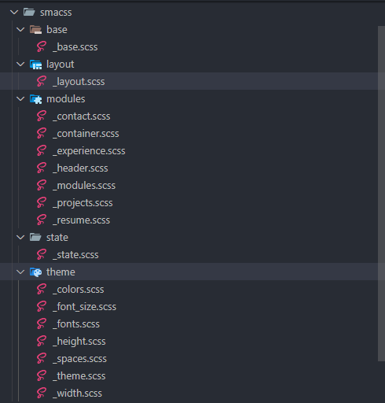

# Portfolio with SASS

Este es una descripción del desarrollo de un protfolio usando sass


## Nomenclaturas

### BEM
 1. Block(bloque): Componente y/o módulo independiente UI
 ```html
     <header class="navigation">
        <nav>
            <a href="#resumen">Resumen</a>
            <a href="#aboutme">Sobre mí</a>
            <a href="#experiencia">Experiencia</a>
            <a href="#proyectos">Proyectos</a>
            <a href="contacto/contacto.html" target="_blank">Contactar</a>
        </nav>
    </header>
 ```
 2. Element(elemento): Cada elemento que conforma el bloque en este caso navigation__list
  ```html
    <header class="navigation">
        <nav class="navigation__list">
            <a class="navigation__item" href="#resumen">Resumen</a>
            <a class="navigation__item" href="#aboutme">Sobre mí</a>
            <a class="navigation__item" href="#experiencia">Experiencia</a>
            <a class="navigation__item" href="#proyectos">Proyectos</a>
            <a class="navigation__item" href="contacto/contacto.html" target="_blank">Contactar</a>
        </nav>
    </header>
 ```
 3. Modifier(modificador): Una variante del bloque que cambia una propiedad del elemento en el siguiente ejemplo sería navigation__item--isActive

   ```html
    <header class="navigation">
        <nav class="navigation__list">
            <a class="navigation__item  navigation__item--isActive" href="#resumen">Resumen</a>
            <a class="navigation__item" href="#aboutme">Sobre mí</a>
            <a class="navigation__item" href="#experiencia">Experiencia</a>
            <a class="navigation__item" href="#proyectos">Proyectos</a>
            <a class="navigation__item" href="contacto/contacto.html" target="_blank">Contactar</a>
        </nav>
    </header>
 ```

### SUITCSS

1. Nomenclatura que inicia con el bloque en Pascal case y usa como separador el - entre el elemento y -- con el modifier

---

.MyComponent {...} 

.MyComponent-element {...}

.MyComponent--modifier {...}

---

---

.Menu {...}

.Menu-item {...}

.Menu-link {...}

.Menu--isLiked {...}

---

```html
        <section class="PrincipalContainer Resume" id="resumen">
            <figure class="Resume-figure">
                
            </figure>
            <article class="Resume-article">
                <h1>Hola, Soy Ronald</h1>
                <br>
                <p>Desarrollador Front-end. De Lima, Perú. Especializado en crear aplicaciones móviles</p>
            </article>           
        </section>
```

#SMACSS

Arquitectura en la organizamos los estilos y componentes por carpetas

1. base: Para estilos generales
2. layout: Para regiones, secciones area de la página.
3. Modules: estructura para los componentes.
4. state: para los estados de los componentes.
5. theme: almacena las variables de colores, tipografías y tamaños.
